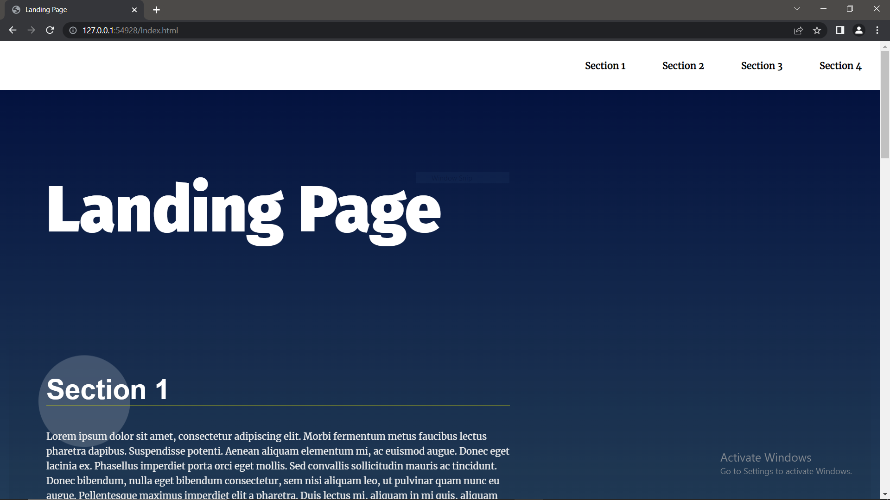

<html>
<h1>Landing Page</h1>
  

     
    <h2>
    Table of contents
    </h2>
      
    <h3> 
        <ul>
            <li>Project Title</li>
            <li>Demo-Preview</li>
            <li>Table of contents</li>
            <li>Description</li>
            <li>Development</li>
            <li>Resources</li>
        </ul>
    </h3>
     
    <h2>Description</h2>
    <h3>A landing page with a dynamic smooth navigation bar and scrolling features.</h3>
     
    <h2>Development</h2>
    <h3>HTML and CSS was developed by udacity ,And the javascript code was developed by Bahy as a part of a project (version 1.0).</h3>
     
    <h2>Resources</h2>
    <h3><li><a href="https://youtu.be/VplDlwLTR50?t=413">https://www.youtube.com/watch?v=VplDlwLTR50   at 6:53</a></li>
        <li><a href ="https://www.w3schools.com/jsref/event_onscroll.asp">https://www.w3schools.com/jsref/event_onscroll.asp</a></li>
        <li><a href ="https://developer.mozilla.org/en-US/docs/Web/API/Element/getBoundingClientRect">https://developer.mozilla.org/en-US/docs/Web/API/Element/getBoundingClientRect</a></li>
        <li><a href ="https://developer.mozilla.org/en-US/docs/Web/API/Element/scrollIntoView">https://developer.mozilla.org/en-US/docs/Web/API/Element/scrollIntoView</a></li>
        <li><a href ="https://developer.mozilla.org/en-US/docs/Web/CSS/all">https://developer.mozilla.org/en-US/docs/Web/CSS/all</a></li>
        <li><a href ="https://youtu.be/9nh0snfJ7Ao?t=244">https://www.youtube.com/watch?v=9nh0snfJ7Ao   at 4:04</a></li>
        <li><a href ="https://www.w3schools.com/jsref/event_preventdefault.asp">https://www.w3schools.com/jsref/event_preventdefault.asp</a></li>
        <li><a href ="https://developer.mozilla.org/en-US/docs/Web/API/Element/children">https://developer.mozilla.org/en-US/docs/Web/API/Element/children</a></li>
</h3>
</html>
